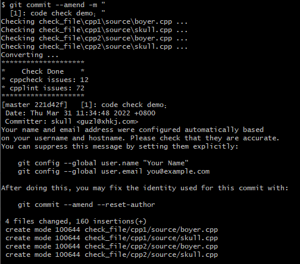
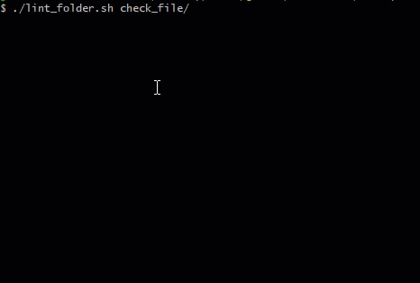
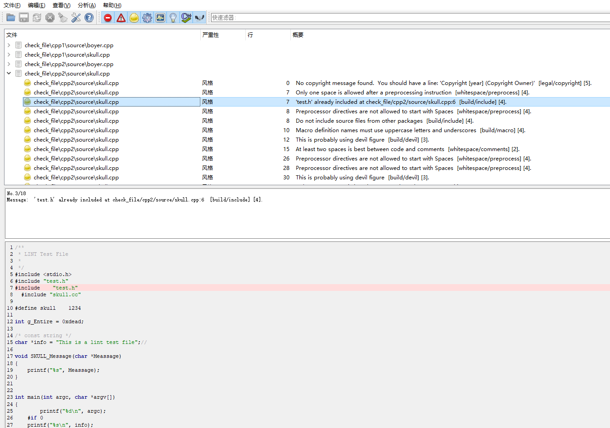

介绍 Lint
---
* 本仓介绍的内容涉及代码静态检查和编码风格检查
* 但主要放在编码风格检查，lint是基于google编码风格检查cpplint的修改版，起别名也是为了区别
* lint较于cpplint优势如下：
  * lint支持自定义编码风格检查(通过配置文件)，而非cpplint特定于google风格
  * lint支持生成结果文件通过cppcheck上位机查看和跳转

快速开始
---
```
.
|————doc  (说明文档及过程文件)
|
|————exe  (打包好的可执行程序)
|
|————git_hook  (嵌入git的钩子文件)
|
|————.scripts  (特殊用法的脚本)
|
|____lint.py  (cpplint改进版)
```

应用场景
---
>嵌入git，在提交阶段进行检查<br>

将git_hook中的文件放在自己项目的.git/hooks路径下，在提交时便会触发代码检查



>独立使用，基于特定的文件或文件夹

将.scripts中的脚本lint_folder.sh和format_cpplint.sh放在要检查的目录同一级即可



>嵌入jenkins进行自动化构建检查
***

### lint检查的结果可以借助cppcheck上位机解析
>确保检查后的`xml`结果放置在刚检查文件夹的上一级，再使用`cppcheck`打开方可实现代码跳转



用法
---
```txt
./lint.exe --help

Syntax: lint  [--verbose=#] [--output=vs7] [--filter=-x,+y,...]
              [--counting=total|toplevel|detailed] [--root=subdir]
              [--linelength=digits] [--headers=x,y,...]
              [--quiet][--help][--useage][--generate][--about]
        <file> [file] ...

  Option:

    output=vs7
      output is formate: 'emacs', 'vs7', 'eclipse'

    verbose=#
      output level: 0-5, message less than [verbose] will not be printed

    quiet
      Don't print anything if no errors are found

    filter=-x,+y,...
      To see a list of all the categories used in cpplint, pass no arg: --filter=
      Examples: --filter=-whitespace,+whitespace/braces
                --filter=whitespace,runtime/printf,+runtime/printf_format
                --filter=-,+build/include_what_you_use

    counting=total
      Error statistics style. The total number of errors found is always printed
      total    => Total errors found:
      toplevel => Category 'whitespace' errors found:
      detailed => Category 'whitespace/parens' errors found:

    root=subdir
      The root directory used for deriving header guard CPP variable.
      Examples:
        code directory: src/chrome/browser/ui/browser/
        No flag               => CHROME_BROWSER_UI_BROWSER_H_
        --root=chrome         => BROWSER_UI_BROWSER_H_
        --root=chrome/browser => UI_BROWSER_H_
        --root=..             => SRC_CHROME_BROWSER_UI_BROWSER_H_

    linelength=digits
      Code line length, default: 120 characters.

    extensions=extension,extension,...
      The allowed file extensions that cpplint will check
      Examples:
        --extensions=hpp,cpp

    headers=x,y,...
      Examples:
        --headers=hpp,hxx
        --headers=hpp

    help
      Displays short usage information and exits.

    useage
      Displays detaile usage information and exits.

    generate
      Generate lint config file 'LINT.cfg' and exits

    about
      Displays version information and exits.
```

配置
---
>生成自定义编码风格配置文件LINT.cfg
```
$ ./lint.exe --generate
The LINT.cfg configuration file is generated successfully.
```
>配置文件说明
```python
# Copyright (c) 2022 skull.gu@gmail.com. All rights reserved.

# Stop searching for additional config files.
set noparent

# Specifies the line of code for the project
linelength=120

# Error filter
# -: filter, +: pass
filter=+whitespace/preprocess

# It's not worth lint-gardening the file.
exclude_files=doc

# The root directories are specified relative to CPPLINT.cfg dir
root=

# The header extensions
headers=

# rule.1
# Naming rules for file names
# 0: indifferent, 1: pure lowercase, 2: lowercase +_, 3: lowercase + digit +_, 4: uppercase, 5: uppercase + digit +_
# default: 3
lint_file_naming=

# rule.2
# Whether copyright is required at the beginning of the file
# start of file
# -1: forbidden, 0: indifferent, 1: required
# default: 1
lint_copyright_sof=

# rule.3
# Whether a new line is required at the end of the file
# end of file
# -1: forbidden, 0: indifferent, 1: required
# default: 1
lint_newline_eof=

# rule.4
# Whether to disable TAB
# -1: forbidden, 0: indifferent
# default: -1
lint_use_tab=

# rule.5
# The code line length
# 0: indifferent, >0: length
# default: 120
lint_line_length=

# rule.6
# The number of lines in the function body
# 0: indifferent, >0: length
# default: 80
lint_function_line=

# rule.7
# Number of Spaces to indent code.
# 0: indifferent, >0: length
# default: 4
lint_space_indent=

# rule.8
# Whether extra space at the end of a line is allowed
# -1: forbidden, 0: indifferent
# default: -1
lint_space_eol=

# rule.9
# Whether to allow multiple instructions in a row
# -1: forbidden, 0: indifferent
# default: -1
lint_multiple_cmd=

# rule.10
# Whether blocks of code are required to use curly braces
# -1: forbidden, 0: indifferent, 1: required
# default: 1
lint_block_braces=

# rule.11
# Whether to leave a space before or after the keyword
# -1: forbidden, 0: indifferent, 1: required
# default: 1
lint_space_keyword=

# rule.12
# Whether to require 1 space before and after the operator
# -1: forbidden, 0: indifferent, 1: required
# default: 1
lint_space_operator=

# rule.13
# Whether to ask preprocessor keyword '#include|#define|if|#elif|#ifdef|#ifndef|#endif' thus
# 0: indifferent, 1: required
# default: 1
lint_preprocess_thus=

# rule.14
# For preprocessor keyword '#include|#define|if|#elif|#ifdef|#ifndef|#endif' allow space after '#'
# -1: forbidden, 0: indifferent
# default: -1
lint_preprocess_space=

# rule.15
# Code Style selection
# 1. K&R
# if () {
#     a = b;
# }
# 2. Allman
# if ()
# {
#     a = b;
# }
# 3. Whitesmiths
# if ()
#     {
#     a = b;
#     }
# 4. GNU
# if ()
#     {
#         a = b;
#     }
# default: 1
lint_code_style=

# rule.16
# The function name is lowercase +_
# 0: indifferent, 1: required
# default: 1
lint_func_naming=

# rule.17
# Macro naming rules
# 0: indifferent, 1: uppercase +_, 2: uppercase + number +_
# default: 1
lint_macro_naming=

# rule.18
# Enum naming rules
# 0: indifferent, 1: uppercase +_, 2: uppercase + number +_
# default: 1
lint_enum_naming=

# rule.19
# Whether devil numbers are allowed
# -1: forbidden, 0: indifferent
# default: -1
lint_devil_numbers=

# rule.20
# Comment style selection
# 0: indifferent, 1: //, 2: /**/
# default: 0
lint_comment_style=

# rule.21
# Whether to disallow more than one consecutive blank line
#  0: indifferent, 1: forbidden
# default: 1
lint_blank_line=

# rule.22
# Whether the type conversion using C-style cast (static_cast | const_cast | reinterpret_cast)
#  0: indifferent, 1: required
# default: 0
lint_cstyle_cast=

# rule.23
# Whether to disallow multiple code statements on the same line
# eg: "a = 1; b = 2;", "if (1) { c = 3; }"
#  0: indifferent, 1: forbidden
# default: 1
lint_multiple_code=

# rule.24
# Whether comments are required after '#endif'
#  0: indifferent, 1: required
# default: 0
lint_comment_endif=

```
>配置文件的与Lint存放在同一级目录，一般是在项目顶级目录<br>

在Lint时会读取配置文件，其中的选项参数决定检查的规则，如果没有找见配置文件则Lint使用默认配置进行规则检查


进展说明
---
1. 文件名命名规则     ***`[DONE]`***
2. 文件首是否要求书写版权    ***`[DONE]`***
3. 文件尾是否要求新行    ***`[DONE]`***
4. 是否允许使用TAB    ***`[DONE]`***
5. 代码行长度要求    ***`[DONE]`***
6. 函数体行数要求    ***`[DONE]`***
7. 代码缩进空格数    ***`[DONE]`***
8. 行尾多余空格是否允许    ***`[DONE]`***
9. 是否允许一行出现多条指令    ***`[DONE]`***
10. 是否要求代码块(if|else|for|while)使用花括号  [1]    ***`[DONE]`***
11. 是否要求关键字前后留1个空格    ***`[DONE]`***
12. 是否要求运算符前后留1个空格(部分实现)    ***`[TODO]`***
13. 是否要求预处理关键字顶格 '#include|#>define|if|#elif|#if>def|#ifn>def|#endif'    ***`[DONE]`***
14. 是否允许预处理关键字井号后有空格'#include|#>define|if|#elif|#if>def|#ifn>def|#endif'    ***`[DONE]`***
15. 代码风格选择(实现了'K&R', 'Allman')   ***`[TODO]`***
16. 函数名命名规则为小写+_    ***`[DONE]`***
17. 宏命名规则    ***`[DONE]`***
18. 枚举命名规则  [1]    ***`[DONE]`***
19. 是否允许出现魔鬼数字    ***`[DONE]`***
20. 注释风格选择    ***`[DONE]`***
21. 是否禁止连续空行超过1行    ***`[DONE]`***
22. 类型转换是否使用C-style cast(static_cast|const_cast|reinterpret_cast)    ***`[DONE]`***
23. 是否禁止多条代码语句在同一行    ***`[DONE]`***
24. '#endif'后是否要求带注释    ***`[DONE]`***

[注]
---
使用pyinstaller工具将python文件打包成可执行文件，优势：只要windows环境就能运行<br>
环境：python2.7不能直接安装，需要特定版本 `pip2 install pyinstaller==3.2.1`

共同进步
---
大家在使用过程中，发现任何bug及改进点欢迎提`issue`反馈给我
